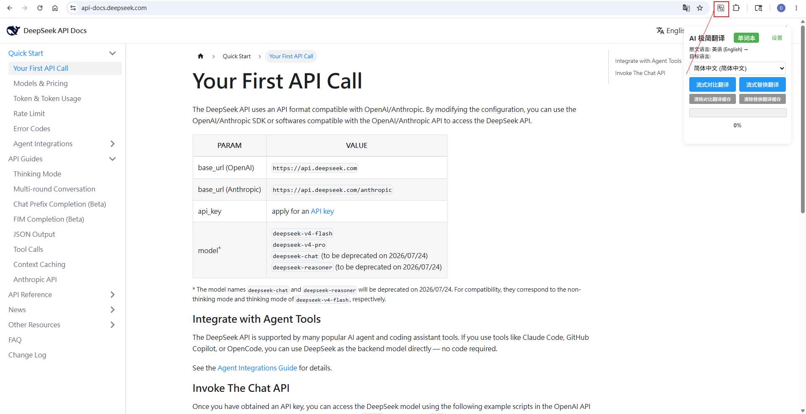
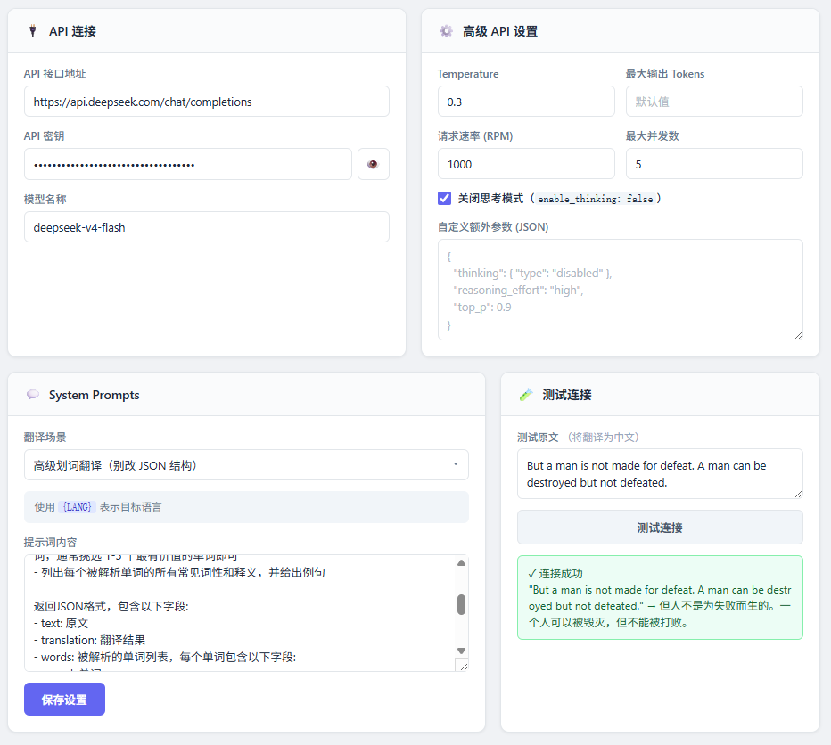
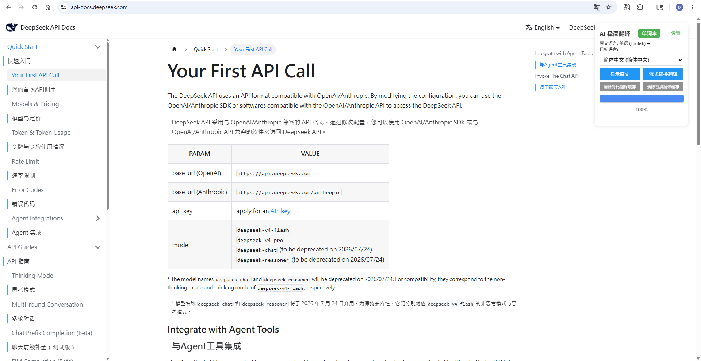
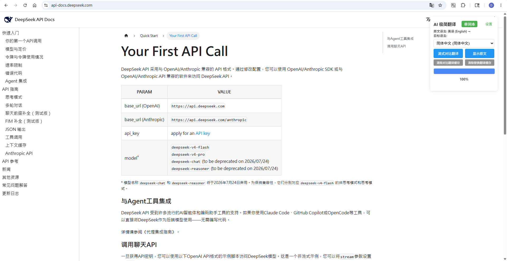
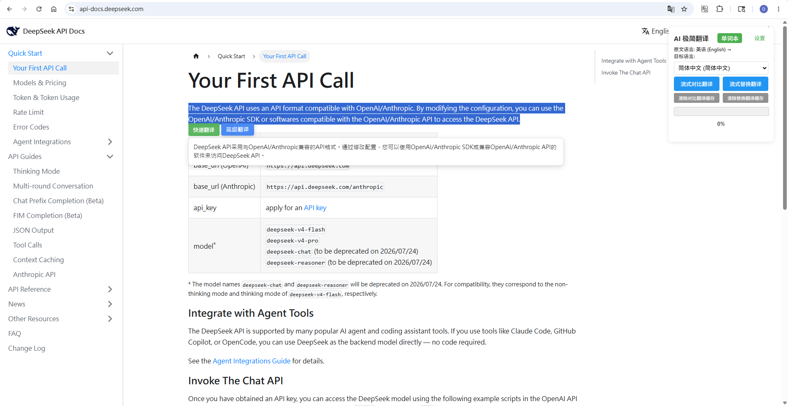
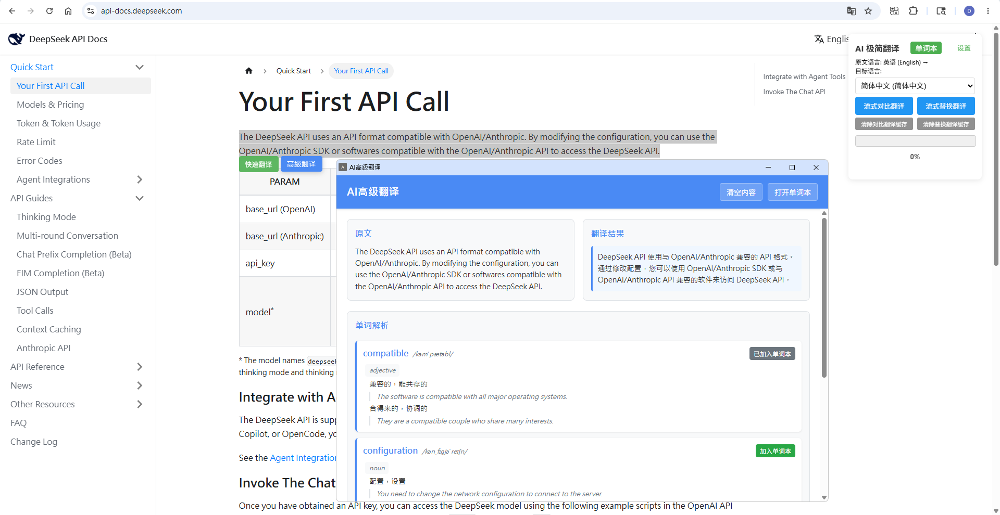
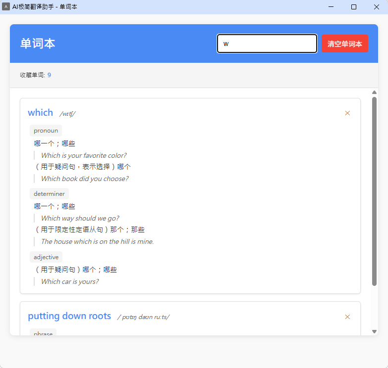

# 极简低配版"沉浸式翻译" Chrome 插件

## 更新说明

2026-05-12

- 支持大模型API的更多配置；支持连接测试；美化了配置页面
- 优化了流式对比翻译和替换翻译中网页标签的获取逻辑

2025-07-14

- 添加了“高级划词翻译”功能，可以看到复杂单词简单释义；添加了简单的单词本功能。

2025-07-10

- 调用大模型 API 进行翻译时采用并发多请求和流式响应，极大提高了翻译速度。
- **整页翻译推荐使用“流式替换翻译”**，
  - “流式对比翻译”对插入布局要求比较高，现在一般的资讯网页还行，但结构复杂的网页比较混乱，后续再思考如何处理。

更多内容查看[CHANGELOG](./CHANGELOG.md)。

## 说明

- 翻译功能有：整个页面的**对比/替换翻译、文本划词翻译、独立小窗翻译**(选中文本右键可见)
  - 整页翻译的内容会保存在缓存中，1 小时内同一个网站不会重复调用 API 进行翻译。
  - 如果需要强制重新翻译，可以点击对应的清除缓存按钮后，重新翻译。
- 翻译功能是基于调用在线服务大模型 API 实现的，所以需要使用者有可用的平台地址和 ak。
  - 暂时是只支持openAI API结构的请求响应，类似deepseek平台、硅基流动、xiaomimino等有专门API文档。

## 安装方式

下载这个项目，解压后，打开 Chrome 或 Edge 浏览器，进入 `chrome://extensions/` 或`edge://extensions/`页面，点击“加载已解压的扩展程序”，选择解压后的文件夹即可。

首次使用一定点击“设置”按钮或者插件图标右键选“选项”，去配置 API 地址、AK 和模型名称，点击“保存设置”。

## 使用截图

- 安装插件后，点击插件图标，右上角会显示出功能弹窗:

- 点击“设置”按钮，配置大模型平台地址、模型名、和 AK，**记得首次使用要保存设置才生效**。
  - 提示词可按需修改，但关键替换词和高级翻译的json结构栏位不要修改，否则无法正确使用。

- 整页翻译：点击功能弹窗中的整页翻译的按钮即可执行相关翻译操作。比如简单的“流式对比翻译”的效果

和简单的“流式替换翻译”效果：

- 划词翻译：对只需要翻译网页中部分文本，在选中文本(划词)后，会出现一个小的“翻译”按钮，点击之后就会弹窗显示翻译结果，目标语言在右上角的配置面板中指定。
  - 快速划词翻译: 一个简单的流式响应翻译结果的弹窗

  
  - 高级划词翻译：一个新的独立弹窗，非流式响应（因为要解析响应结果的 JSON 结构），简单对比显示，以及一些复杂单词说明，并可以加入单词本

  
  - 单词本: 可以将高级划词翻译的单词解析放入单词本（浏览器缓存管理），可以从高级划词翻译弹窗或右上角的功能弹窗中打开。

  

- 如果是**阅读 pdf 文件（无法使用划词翻译）**，或者也是一般网页，右键选择“AI 极简翻译-翻译选中文本”，会弹出独立翻译窗口。

- 这个独立窗口可以当成个简单的翻译工具，复制需要翻译的内容，选择目标语言，然后随意翻译即可。

## 其他补充

- 翻译速度和效果和大模型类型和质量相关，默认都是流式响应(除了高级划词翻译)。
- 因为是调用大模型 API 进行翻译，网页内容过大时，可能完全翻译完会比较慢。
  - 可按 F12 在控制台查看当前正在调用 API 翻译的文本字段。
  - 可以随时停止翻译，刷新页面就恢复原网页，再次翻译会继续上次未完成的翻译(只要缓存未过期)。
- **只会翻译点击翻译时已经加载的内容**
- 整页翻译因为侵入式，布局显示效果可能不是很好看；复杂网页可能耗时也久，不如直接划词翻译。

## 额外说明

- 最后，本项目仅用于学习交流，有其他需求可交流反馈。有需求直接拿去用，不用跟我说。
